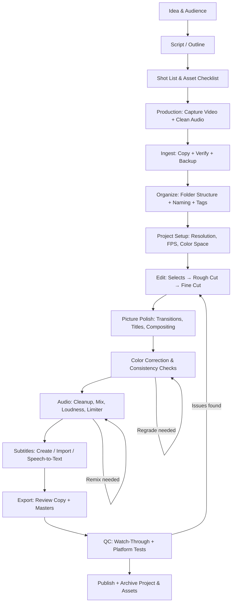

# The Video Production Pipeline

Video editing is not a collection of buttons you press in an application. It is one phase in a **production pipeline** -- a sequence of decisions and actions where the output of each phase becomes the input of the next.

This matters because **decisions compound**. What you choose during capture constrains what you can do in the edit. How you edit determines what the export can deliver. How you export affects how the platform processes and presents your video to viewers. Understanding the full pipeline before you touch any tool means you make better decisions at every stage.

## The Full Pipeline

> [!info] Revision loops are normal
> The arrows pointing backward in the diagram are not failures -- they are a standard part of production. Expect to loop through edit, color, and audio multiple times. Professional editors budget time for revision. So should you.

## Phase-by-Phase Overview

### Idea and Audience

Every video starts with two questions: *What is this about?* and *Who is it for?* The answers shape every downstream decision -- tone, length, pacing, visual style, and where you publish.

> **ForgeFrame:** Use `/ff-video-idea-to-outline` to turn a rough idea into a structured tutorial outline with viewer promise, teaching beats, pain points, and chapter structure. Or use `/ff-new-project` to create a full project workspace, vault note, and production plan in one step. You can also work through these questions manually in [[03-from-idea-to-outline|Ch.03]].

See: [[03-from-idea-to-outline|From Idea to Outline]]

### Script or Outline

Whether you write a word-for-word script or a bullet-point outline, having a written plan before you record saves hours of editing. You cut in the document, not on the timeline.

> **ForgeFrame:** Use `/ff-tutorial-script` to generate a production-ready script with hook, step-by-step beats, common mistakes, and voiceover notes from your outline. You can also write the script manually using the structure in [[04-scripts-shot-plans-capture-prep|Ch.04]].

See: [[04-scripts-shot-plans-capture-prep|Scripts, Shot Plans & Capture Prep]]

### Shot List and Asset Checklist

A shot list translates your script into concrete camera setups. An asset checklist enumerates everything you need beyond your own footage: screen recordings, stock clips, graphics, music, sound effects.

> **ForgeFrame:** Use `/ff-shot-plan` to generate a categorized shot list (A-roll, overhead, closeups, inserts, glamour) from your script or outline. Use `/ff-broll-whisperer` to identify B-roll moments from your transcript after recording. You can also build a shot list manually using the categories in [[04-scripts-shot-plans-capture-prep|Ch.04]].

See: [[04-scripts-shot-plans-capture-prep|Scripts, Shot Plans & Capture Prep]]

### Production: Capture Video and Clean Audio

Recording your footage and audio. The goal is to capture the best possible source material so you spend less time fixing problems in post. This means consistent lighting, stable framing, and clean audio at the source.

> **ForgeFrame:** Use `/ff-capture-prep` to generate a pre-shoot checklist with camera settings, audio setup, lighting notes, and an optimized shot order that minimizes setup changes between shots. You can also use the manual filming guide in [[05-filming-your-tutorial|Ch.05]].

See: [[05-filming-your-tutorial|Filming Your Tutorial]]

### Ingest: Copy, Verify, Backup

Getting footage off your camera or recorder and onto your editing drive. This is also when you verify file integrity and create your first backup. Never edit directly from a camera card.

> **ForgeFrame:** The `/ff-new-project` skill creates a workspace with organized intake, transcripts, and project folders. Run `wvb media ingest <workspace>/` after filming to copy and verify your footage automatically. You can also ingest manually following the workflow in [[07-your-first-edit|Ch.07]].

See: [[07-your-first-edit|Your First Edit]]

### Organize: Folder Structure, Naming, Tags

A consistent folder structure and naming convention means you (and your tools) can find any asset instantly. This is the foundation of project hygiene -- skip it and you pay the cost in every later phase.

> **ForgeFrame:** ForgeFrame workspaces use a consistent folder structure out of the box. Use `/ff-obsidian-video-note` to keep your Obsidian vault note in sync with the workspace -- outline, script, shot plan, and edit notes all live in one place. You can also organize manually as described in [[07-your-first-edit|Ch.07]].

See: [[07-your-first-edit|Your First Edit]]

### Project Setup: Resolution, Frame Rate, Color Space

Configuring your Kdenlive project to match your source footage. Getting this wrong causes performance problems, unexpected cropping, or color shifts that are difficult to diagnose later.

See: [[06-kdenlive-fundamentals|Kdenlive Fundamentals]]

### Edit: Selects, Rough Cut, Fine Cut

The core editorial process. First you mark your best takes (selects), then assemble them into a rough structure (rough cut), then tighten timing, pacing, and flow (fine cut). This is where the story takes shape.

> **ForgeFrame:** Use `/ff-auto-editor` to assemble a first-cut Kdenlive timeline by matching clips to script steps automatically. Then use `/ff-rough-cut-review` to get pacing feedback, identify missing visuals, and surface repetition before your fine cut. For pacing and energy analysis, use `/ff-pacing-meter`. You can also edit manually as described in [[06-kdenlive-fundamentals|Ch.06]] and [[07-your-first-edit|Ch.07]].

See: [[06-kdenlive-fundamentals|Kdenlive Fundamentals]], [[07-your-first-edit|Your First Edit]]

### Picture Polish: Transitions, Titles, Compositing

Adding visual elements that support the story: transitions between scenes, title cards, lower thirds, picture-in-picture, and simple compositing. The rule of thumb: if the viewer notices the effect, you have used too much.

> **ForgeFrame:** Use `/ff-pattern-brain` to extract measurements and build steps from your transcript and generate text overlay content for workshop tutorials. Manual transition and title workflows are covered in [[08-transitions-and-compositing|Ch.08]] and [[12-effects-titles-graphics|Ch.12]].

See: [[08-transitions-and-compositing|Transitions & Compositing]], [[12-effects-titles-graphics|Effects, Titles & Graphics]]

### Color Correction and Consistency Checks

Ensuring every shot in a sequence looks like it belongs with its neighbors. This starts with correcting white balance and exposure (correction), then optionally applying a creative look (grading). Consistency matters more than style.

> **ForgeFrame:** The `color_analyze` MCP tool checks white balance and exposure consistency across your timeline. The `color_apply_lut` tool applies a correction LUT to all clips at once. You can also color correct manually using the 5-step workflow in [[09-color-correction-and-grading|Ch.09]].

See: [[09-color-correction-and-grading|Color Correction & Grading]]

### Audio: Cleanup, Mix, Loudness, Limiter

Cleaning up background noise, balancing dialogue against music and sound effects, hitting loudness targets for your platform, and applying a limiter to prevent clipping. Bad audio loses viewers faster than bad video.

> **ForgeFrame:** Use `/ff-audio-cleanup` to run the full audio treatment chain automatically: noise reduction, EQ, dynamic compression, de-essing, loudness normalization to −14 LUFS, and peak limiting. You can also process audio manually as described in [[10-audio-production|Ch.10]].

See: [[10-audio-production|Audio Production]]

### Subtitles: Create, Import, Speech-to-Text

Adding subtitles improves accessibility and engagement. You can write them manually, import an SRT file, or use speech-to-text tools to generate a draft that you then correct.

See: [[12-effects-titles-graphics|Effects, Titles & Graphics]]

### Export: Review Copy and Masters

Rendering your timeline to a deliverable file. You will typically produce a review copy (smaller, faster to share for feedback) and one or more master exports (high quality, platform-specific settings).

> **ForgeFrame:** The `render_final` MCP tool renders your Kdenlive timeline using a named export profile (`youtube-1080p`, `youtube-4k`, `master-prores`, `master-dnxhr`, etc.). You can also export manually using the render profile table in [[13-formats-codecs-export|Ch.13]].

See: [[13-formats-codecs-export|Formats, Codecs & Export]]

### Quality Control: Watch-Through and Platform Tests

Watching your export from start to finish -- ideally on a different device or screen -- checking for audio sync issues, visual glitches, subtitle timing, and anything that slipped through the edit. Then testing on your target platform to catch processing artifacts.

> **ForgeFrame:** The `qc_check` MCP tool scans your export for black frames, silence, loudness issues, clipping, and VFR problems before you publish. Use `media_check_vfr` to detect variable frame rate files. You can also run a manual watch-through using the checklist in [[14-quality-control|Ch.14]].

See: [[14-quality-control|Quality Control]]

### Publish and Archive

Uploading to your platform with correct metadata (title, description, tags, thumbnail). Then archiving your project files and assets so you can revisit or repurpose the project later without losing anything.

> **ForgeFrame:** Use `/ff-publish` to generate YouTube title options, description, tags, chapter markers, and a pinned comment from your transcript. Use `/ff-social-clips` to extract short-form clips for YouTube Shorts, Reels, and TikTok. Use `/ff-youtube-analytics` to track performance after publishing. You can also publish manually using the workflow in [[15-publishing-to-youtube|Ch.15]] and [[16-social-media-repurposing|Ch.16]].

See: [[15-publishing-to-youtube|Publishing to YouTube]], [[16-social-media-repurposing|Social Media & Repurposing]]

## Where ForgeFrame Fits

ForgeFrame integrates with each phase of the pipeline. The table below maps every skill to the phase it automates and the chapter where you learn the underlying concept.

| Pipeline Phase | ForgeFrame Skill | What It Automates | Learn the Concept |
|---|---|---|---|
| Idea & Audience | `/ff-video-idea-to-outline` | Outline with viewer promise, teaching beats, chapter structure | Ch.03 |
| Start a Project | `/ff-new-project` | Workspace, vault note, outline, script, and shot plan in one step | Ch.00 |
| Script | `/ff-tutorial-script` | Hook, steps, common mistakes, voiceover notes | Ch.04 |
| Shot List | `/ff-shot-plan` | Categorized shot list from script or outline | Ch.04 |
| B-Roll Planning | `/ff-broll-whisperer` | B-roll suggestions from transcript | Ch.04 |
| Capture Prep | `/ff-capture-prep` | Pre-shoot checklist, camera settings, optimized shot order | Ch.05 |
| Vault Notes | `/ff-obsidian-video-note` | Creates and updates Obsidian project notes throughout production | Ch.03 |
| Edit: First Cut | `/ff-auto-editor` | Assembles a Kdenlive timeline by matching clips to script steps | Ch.07 |
| Edit: Review | `/ff-rough-cut-review` | Pacing, repetition, missing visuals, chapter break suggestions | Ch.07 |
| Edit: Pacing | `/ff-pacing-meter` | WPM analysis, energy drops, viewer retention problems | Ch.11 |
| Edit: Voiceover | `/ff-voiceover-fixer` | Rewrites rambling segments into clean tutorial narration | Ch.11 |
| Edit: Overlays | `/ff-pattern-brain` | Extracts measurements and build steps for text overlays | Ch.12 |
| Audio | `/ff-audio-cleanup` | Full audio chain: noise reduction → normalization → limiting | Ch.10 |
| Publish | `/ff-publish` | YouTube title, description, tags, chapters, pinned comment | Ch.15 |
| Social | `/ff-social-clips` | Short-form clips for YouTube Shorts, Reels, TikTok | Ch.16 |
| Analytics | `/ff-youtube-analytics` | Channel performance reports, content strategy insights | Ch.15-16 |

> **ForgeFrame works standalone at any phase.** You do not need to use every skill in order. Jump in at the edit phase with `/ff-auto-editor`, or use only `/ff-audio-cleanup` on an existing project. Every skill includes a manual fallback for steps you prefer to do yourself.

## Why Decisions Compound

To make this concrete:

- **Capture affects edit performance.** If you record in a highly compressed codec (e.g., H.264 long-GOP from a phone), your editor has to work harder to decode every frame. Recording in a more edit-friendly format (or transcoding on ingest) makes the timeline snappier.
- **Edit affects export quality.** If you scale up low-resolution footage on the timeline, the export will show soft or blocky patches. If you stack too many effects without understanding render order, you get unexpected color shifts.
- **Export affects platform processing.** If you upload a file that does not match the platform's preferred specs, it will re-encode your video with its own settings -- often producing worse quality than if you had matched the spec yourself.

Understanding these relationships is the single most valuable thing you can learn early. The [[07-your-first-edit|Your First Edit]] project in Ch.07 is designed to make each of these connections tangible.
