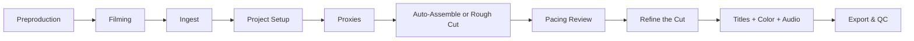

# Your First Edit

This is your capstone project. You'll produce a complete 60-90 second tutorial or explainer video from scratch, touching every major phase of the editing workflow. By the end, you'll have a finished piece you can publish -- and a repeatable process you can apply to every future project.

Each step below shows **both ways**: the manual approach using Kdenlive directly, and the ForgeFrame way using skills to automate the repetitive parts.

## What You'll Create

A short tutorial video that includes:

- **A-roll narration** -- talking head or voiceover driving the story
- **B-roll inserts** -- cutaways that illustrate your points
- **Title and lower third** -- a main title card and a name/topic graphic
- **Light color correction** -- white balance and exposure adjustments
- **Basic audio polish** -- noise reduction, leveling, and loudness normalization
- **Two exports** -- a web-optimized delivery copy and a high-quality master

> [!example] What you'll need
> - A computer with Kdenlive installed (any recent version)
> - A microphone (USB condenser, lavalier, or even a phone headset -- anything better than a built-in laptop mic)
> - A camera or screen recorder (your phone, a webcam, or OBS for screen capture)
> - 2-4 GB of free disk space for media and renders
> - ForgeFrame installed and initialized (optional -- every step includes the manual path)

> [!info] Total time: 4-8 hours spread across 1-2 sessions
> Don't try to grind this out in a single marathon. The steps below include natural break points. A good split is to handle preproduction and filming in session one, then ingest through export in session two.

## Step-by-Step Workflow



---

### 1. Preproduction (30-60 min)

Write your one-paragraph objective, draft a script or bullet outline, build your shot list, and lock in your delivery specs. See Ch.03 (From Idea to Outline) and Ch.04 (Scripts, Shot Plans, and Capture Prep) for detailed walkthroughs.

**Deliverables at the end of this step:**
- Written objective (3-4 sentences)
- Script or outline with timed sections
- Shot list / asset checklist (A-roll and B-roll)
- Target specs decided (default: 1080p / 30 fps / BT.709)

> **ForgeFrame:** Run `/ff-video-idea-to-outline` with your topic and audience in mind. The skill generates a structured teaching outline with suggested beats and pacing. Then use `/ff-tutorial-script` to expand the outline into a full script, and `/ff-shot-plan` to generate your shot list from the script.
>
> You can also do this manually: write your objective in 3-4 sentences, outline your teaching beats, and list every shot you'll need to cover each point.

---

### 2. Filming (30-60 min)

Record your A-roll footage with clean audio. Follow your shot list and check off each shot as you capture it.

- Frame your talking head with the rule of thirds; keep eye line near the top third
- Record screen capture at your target resolution (1080p native, not scaled)
- Capture every B-roll shot on your checklist
- Record a 10-second room tone / silence take for noise profiling later

See Ch.05 (Filming Your Tutorial) for camera settings, lighting setups, and VFR prevention.

> **ForgeFrame:** Run `/ff-capture-prep` before you film. It reads your shot plan and generates a pre-shoot checklist customized for your setup -- mic check, lighting configuration, VFR settings to disable on your specific device, and shooting order to minimize setup changes.
>
> You can also do this manually: run through a checklist of camera settings (resolution, frame rate, manual white balance, audio gain), confirm your mic is working, and check off each shot as you capture it.

---

### 3. Ingest and Organization (15-30 min)

Copy all media from cards, recorders, and screen capture folders into your project's media directory. **Never edit directly from a memory card.**

**Manually:**
- Create a folder structure: `footage/`, `audio/`, `graphics/`, `exports/`
- Import everything into the Kdenlive Project Bin (see Ch.06 -- Kdenlive Fundamentals)
- Rename clips to match your shot list labels (A1, A2, B1, B2, etc.)
- Verify frame rates and resolutions match your plan -- flag any mismatches now
- Transcode any VFR footage to CFR before importing: `ffmpeg -i input.mp4 -vsync cfr -r 30 output.mp4`

> **ForgeFrame:** Run `/ff-new-project` to create a structured workspace for this video. Then use the `media_ingest` tool to copy files into the workspace, auto-detect VFR issues, and generate clip labels from file names. The tool will flag any mismatched frame rates before you touch the timeline.
>
> You can also do this manually using the folder structure and FFmpeg commands above.

---

### 4. Project Setup (10 min)

Create a new Kdenlive project and configure the project profile to match your delivery specs.

**Manually:**
- Open Kdenlive and create a new project
- Set project profile: 1080p, 30 fps (or whatever you chose in preproduction)
- Confirm audio sample rate: 48 kHz
- Save the project file inside your project folder (not in a temp directory)

See Ch.06 (Kdenlive Fundamentals) for the full project settings walkthrough.

> **ForgeFrame:** Use `project_setup_profile` to auto-generate a Kdenlive project profile from your ingested footage. The tool reads resolution, frame rate, and codec metadata from your clips and produces a matching profile ready to load.
>
> You can also do this manually by following the project settings guide in Ch.06.

---

### 5. Proxies (optional but recommended for 4K / H.265)

If your source footage is 4K or encoded in H.265/HEVC, proxy editing will make your timeline dramatically more responsive.

**Manually:**
- Enable proxy clips in Project Settings (*Project* > *Project Settings* > *Proxy* tab)
- Let Kdenlive generate proxies (this runs in the background)
- Edit on proxies; Kdenlive automatically swaps back to originals at render time

See the Proxies section in Ch.06 for setup and recommended proxy codecs.

---

### 6. Assemble Your Rough Cut (60-120 min)

This is where the edit begins. You have two paths: build the rough cut manually, or let ForgeFrame assemble a first cut you then refine.

**Manually:**

Work in two passes.

*Rough cut:* Lay your A-roll on the timeline in script order. Use 3-point editing (see Ch.06) to set in/out points in the clip monitor and drop segments onto V1. Don't worry about precision -- just get the structure down.

*Fine cut:* Tighten every edit.
- Trim dead air, false starts, and filler words
- Drop B-roll onto V2 above the A-roll it covers
- Watch the full sequence and note any pacing issues

> **ForgeFrame:** Run `/ff-auto-editor` once your clips are ingested and labeled. The skill reads your script steps and clip transcripts, matches footage to each step, and assembles a Kdenlive project as a first-cut timeline.
>
> It will show you its matching plan before building:
>
> ```
> Step 1: "Cut the fabric" → overhead_003.mp4 (primary, 0.85) + closeup_ruler.mp4 (insert, 0.62)
> Step 2: "Apply glue" → closeup_glue.mp4 (primary, 0.77)
> Unmatched clips: broll_workshop.mp4, intro_wide.mp4
> ```
>
> Review the plan, confirm or adjust clip assignments, then say "build it." The assembled project opens in Kdenlive, ready for your manual refinement pass.

---

### 7. Pacing Review (15-30 min)

Before you polish, check whether the cut is structurally sound. Catching pacing and repetition problems now saves you from fixing them after you've already added titles and color.

**Manually:**
- Watch the entire sequence at 1x speed, noting timestamps where the energy drops
- Flag any segment longer than 30 seconds of unbroken talking head
- Look for content that repeats between your intro and conclusion
- Note any moment where you say "you can see that..." with no corresponding visual

> **ForgeFrame:** Run `/ff-rough-cut-review` after assembling the timeline. The skill analyzes your transcript and edit markers, then produces a structured review covering:
>
> - **Pacing issues** -- segments over 30 seconds without a visual cut
> - **Repetition flags** -- content repeated between intro, body, and conclusion
> - **Missing visuals** -- moments where narration refers to something not on screen
> - **Overlay opportunities** -- measurements and lists that need text graphics
> - **Suggested chapter breaks** -- timestamps for YouTube chapters
>
> You'll get a priority action list telling you what to fix first. Address those items, then move to step 8.
>
> You can also do this manually by watching your cut critically and taking timestamped notes.

---

### 8. Refine the Cut (30-60 min)

Act on the feedback from your pacing review. This step is always manual -- it requires editorial judgment that tools cannot replace.

- Trim or remove pacing problems flagged in the review
- Cover long talking-head segments with B-roll from your unmatched clips
- Cut duplicate or repetitive content
- Add rough text markers where overlays are needed (you'll build them in step 9)
- Watch the cut again from the top -- it should feel tighter

---

### 9. Titles, Color, and Audio (45-90 min)

These are three separate passes. Don't try to do them simultaneously.

**Titles and graphics:**
Create your main title card and a lower third with your name or topic label. Use Kdenlive's built-in titler or import PNGs from Inkscape or Canva. See Ch.12 (Effects, Titles, and Graphics) for the step-by-step titler workflow.

**Color correction:**
The goal is to make footage look *correct*, not stylized. Apply Lift/Gamma/Gain adjustments so skin tones sit in the right range, and use the Waveform scope to verify exposure. See Ch.09 (Color Correction and Grading) for the five-step correction workflow.

**Audio polish:**
Apply noise reduction, leveling, and loudness normalization. Target -14 LUFS for YouTube delivery. See Ch.10 (Audio Production) for the complete processing chain.

> **ForgeFrame:** Use `/ff-audio-cleanup` to run the full audio processing chain automatically -- noise reduction, compression, normalization -- across your dialogue tracks. It targets the -14 LUFS YouTube standard by default.
>
> You can also do this manually using the audio chain described in Ch.10.

---

### 10. Export and QC (20-60 min)

Render two versions:

| Version | Purpose | Suggested Settings |
|---------|---------|--------------------|
| **Web delivery** | Upload to YouTube / Vimeo | H.264, 1080p, 30 fps, AAC audio, ~10-15 Mbps VBR |
| **Master** | Archive / future re-encodes | DNxHR HQ or ProRes 422, same resolution and fps |

**Quality check (QC) your web export before publishing:**

- [ ] Watch the entire video at 1x speed -- no skipping
- [ ] Check first and last 2 seconds for black flash or frame glitches
- [ ] Verify audio levels are consistent (no sudden jumps or drops)
- [ ] Confirm the file plays correctly in VLC or a browser

See Ch.13 (Formats, Codecs, and Export) for render preset details, and Ch.14 (Quality Control) for automated QC tools.

> **ForgeFrame:** Use `render_final` to render using a named profile (`youtube-1080p`, `master-dnxhr`, etc.), then run `qc_check` on the output. The QC tool scans for black frames, silence gaps, loudness compliance, and clipping -- and tells you exactly what to fix if something fails.
>
> You can also do this manually using the QC checklist above.

---

## Congratulations

If you've made it through all ten steps, you've built a real video from nothing. The process you just followed -- preproduction through QC -- is the same process professional editors use on every project, scaled to a manageable size.

Your next move: pick a topic you actually care about and do it again. The second time is always faster. As you build muscle memory, consider running the full ForgeFrame pipeline from the start -- `/ff-video-idea-to-outline` through `/ff-auto-editor` through `/ff-rough-cut-review` -- to see how much of the structural work can be automated before you ever open Kdenlive.
