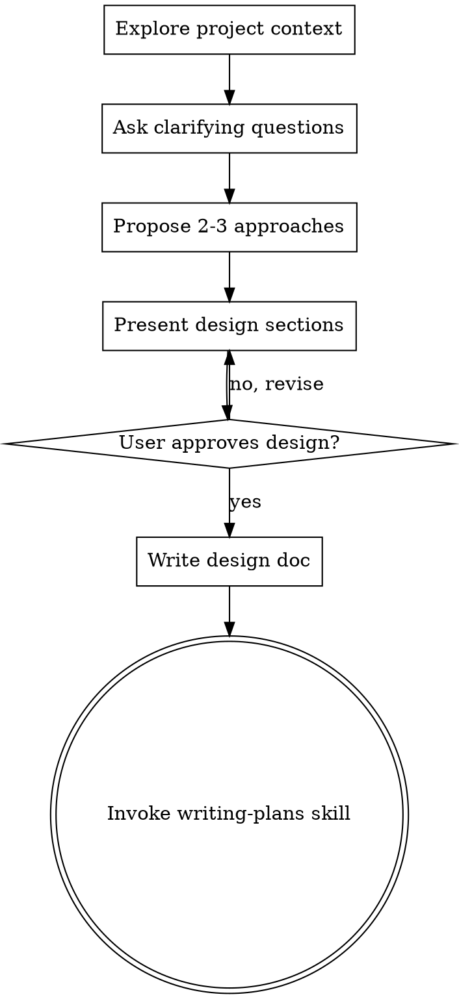

# look at the current mcp tools and skills and see if there is anything we need t…

### User

look at the current mcp tools and skills and see if there is anything we need to add in order to do the parallax effect in this video
https://www.youtube.com/watch?v=BPBdQkFlUPU

I dont neccesarily want a skill do this exact effect unless you think adding one would be helpful over all, but I do want the mcp to have the base components it needs to do the effect
also update the video editing guide with a section on how to do this effect with and without the mcp 

0:00
In this video, we're going to make these
0:01
parallax effects. You can create them
0:03
using any software, but for this demo,
0:05
I'm using Caden Live. It actually
0:07
doesn't matter whether you edit on Cap
0:08
Cut, After Effects, or anything else.
0:10
You can still follow along. I'm sure
0:12
you'll learn a lot from this, and even
0:14
remake it the same or even better in
0:16
your own software. You're going to need
0:17
a lot of images for this. First, I added
0:20
this forest image, and then on top of
0:22
it, I added the cameraman's image. Using
0:24
chroma key, I removed the green
0:26
background.
0:29
I move this effect to the parent image
0:31
on the project folder so everything
0:32
stays clean. I like things to be easy to
0:35
understand and follow.
0:37
After that, I scaled the cameraman down,
0:39
placed him on the ground, and flipped
0:40
him on the X-axis.
0:44
Next, it was time to add a shadow. Using
0:46
the title clip feature, I added this
0:48
black circle under the cameraman. The
0:50
circle is slightly transparent. If you
0:52
don't know how to recreate this in your
0:54
software, the simplest way, which works
0:56
in pretty much every editor, is to just
0:58
download a transparent black circle from
1:00
your browser and scale it down on the
1:01
Y-axis. Simple as F. After adding the
1:04
shadow, I placed that clip below the
1:06
main character's track so it stays
1:08
behind him. I added a box blur to make
1:10
it look more like a real shadow. Not
1:12
bad. Finally, it was time to add forest
1:15
elements. I started with trees. I placed
1:17
a tree PNG, positioned it properly,
1:19
duplicated it, and placed another one
1:21
that's bigger and lower on the Yaxis to
1:24
create the illusion that it's in front.
1:26
I added shadows to the trees the same
1:27
way we did for the cameraman. Looks way
1:29
better already. Let's go. Okay, now it's
1:32
time to add rocks. Let me just customize
1:35
the UI so I can think better. [music]
1:37
Oh, wait. Why is my cursor not working?
1:40
Ah, it as always, it crashed. All right,
1:43
let's reopen it. I'm not going to cry
1:45
about it. Just hit the sub and like
1:47
button, please. After reopening KD and
1:49
Live, I added two big rocks that will be
1:51
at the very front.
1:56
I placed them above all the tracks
1:57
because we're going to fill the lower
1:59
tracks with a lot of elements, and I
2:00
don't want those elements overlapping
2:02
the rocks. After putting the rocks above
2:04
everything, I temporarily disabled the
2:06
tracks so I could focus on the rest. I
2:08
added two more rocks. For the green one,
2:11
I placed it behind the tree. Added a
2:13
shadow for the green rock. Then for the
2:15
white one too and flipped it. I know it
2:18
doesn't look great, but hopefully we'll
2:19
fix that in color grading.
2:24
Then I placed the two rocks below the
2:26
timeline and disabled them again for
2:27
good reason. After that, I added this
2:30
stem, removed the blue background and
2:32
positioned it nicely.
2:36
After troubleshooting the background a
2:37
bit, yeah, it still doesn't look
2:38
perfect. It was time to add the leaves.
2:41
Using rotoscoping, I cut the leaves
2:43
separately and placed them wherever I
2:44
wanted. You can use any tool that gets
2:46
the job done.
2:50
That leaf is doing a great job hiding
2:52
that rock. Nice job, buddy. After
2:55
enabling all the elements again, I
2:57
increased their duration by plus 5
2:59
seconds, making the total 10 seconds.
3:01
Then it was finally time to animate
3:03
everything. Hey guys, since I'm getting
3:05
into freelancing for video editing, I'm
3:07
starting by offering free video editing
3:09
services to a limited number of clients.
3:11
If you're interested, just contact me
3:13
through any of these methods. Portfolio
3:15
link is in the description. Now, back to
3:17
the video. I started animating and
3:19
honestly, there's no rocket science
3:21
here. Just remember one formula for the
3:23
parallax effect. If you are zooming in,
3:26
like I'm doing here to focus on the
3:27
cameraman, you scale things up. If
3:30
you're zooming out, scale things down.
3:34
Objects in front should scale up more
3:36
and move more. Objects that are farther
3:39
away should scale up the least and move
3:42
very little. Move each element so it
3:45
goes slightly out of view. All this
3:48
works because of one thing. Parallax.
3:52
The closer the object is to the camera,
3:54
the more it moves. The farther it is,
3:56
the less it moves. I hope you're enough
3:59
good observer to understand this. While
4:01
animating, I left the trees slightly
4:03
visible because it looks nicer, right?
4:06
After some final troubleshooting, this
4:08
is what we ended up with. I know the
4:10
rocks and a few forest elements feel
4:12
kind of wasted, but okay, maybe those
4:14
little details matter. After that, I
4:16
blurred the elements in front to give a
4:18
better 3D sense and make the focus go
4:20
toward the cameraman.
4:22
At this point, 90% of the work is done.
4:25
Now, it's time for color grading, which
4:27
you can see happening here. My main goal
4:30
was to make everything blend together,
4:32
not just turn the whole scene green and
4:34
shiny.
4:41
Finally, I [music] rendered it and boom,
4:43
the effect is done. So, that's how you
4:45
me this effect. I hope this video was at
4:46
least a little helpful. If it was, like
4:48
and sub. And if you don't want these
4:50
tutorials, hand me to suddenly stop. I'd
4:52
really appreciate it if you could fund
4:54
me using this QR code because this
4:56
burning potato PC can blast anytime. So
4:59
yeah, please. You can only fund via an
5:01
Indian bank account because of some
5:03
classic RBI rules. If you can't donate
5:05
because of currency barriers, check if
5:07
Superthanks is available. And if it is,
5:09
thank you so much. I genuinely can't
5:11
express that feeling with words and this
5:13
silly AI dub. Thank you again. Anyway,
5:16
thanks for watching and have a nice day.
5:18
Keep cooking.

### Assistant

I'll invoke the superpowers skill first since it's required for starting conversations, then explore the codebase.

### Assistant

*[calling tool: Skill]*

### User

Base directory for this skill: C:\Users\CalebBennett\.claude\plugins\cache\superpowers-marketplace\superpowers\4.3.0\skills\brainstorming

# Brainstorming Ideas Into Designs

## Overview

Help turn ideas into fully formed designs and specs through natural collaborative dialogue.

Start by understanding the current project context, then ask questions one at a time to refine the idea. Once you understand what you're building, present the design and get user approval.

<HARD-GATE>
Do NOT invoke any implementation skill, write any code, scaffold any project, or take any implementation action until you have presented a design and the user has approved it. This applies to EVERY project regardless of perceived simplicity.
</HARD-GATE>

## Anti-Pattern: "This Is Too Simple To Need A Design"

Every project goes through this process. A todo list, a single-function utility, a config change — all of them. "Simple" projects are where unexamined assumptions cause the most wasted work. The design can be short (a few sentences for truly simple projects), but you MUST present it and get approval.

## Checklist

You MUST create a task for each of these items and complete them in order:

1. **Explore project context** — check files, docs, recent commits
2. **Ask clarifying questions** — one at a time, understand purpose/constraints/success criteria
3. **Propose 2-3 approaches** — with trade-offs and your recommendation
4. **Present design** — in sections scaled to their complexity, get user approval after each section
5. **Write design doc** — save to `docs/plans/YYYY-MM-DD-<topic>-design.md` and commit
6. **Transition to implementation** — invoke writing-plans skill to create implementation plan

## Process Flow



**The terminal state is invoking writing-plans.** Do NOT invoke frontend-design, mcp-builder, or any other implementation skill. The ONLY skill you invoke after brainstorming is writing-plans.

## The Process

**Understanding the idea:**
- Check out the current project state first (files, docs, recent commits)
- Ask questions one at a time to refine the idea
- Prefer multiple choice questions when possible, but open-ended is fine too
- Only one question per message - if a topic needs more exploration, break it into multiple questions
- Focus on understanding: purpose, constraints, success criteria

**Exploring approaches:**
- Propose 2-3 different approaches with trade-offs
- Present options conversationally with your recommendation and reasoning
- Lead with your recommended option and explain why

**Presenting the design:**
- Once you believe you understand what you're building, present the design
- Scale each section to its complexity: a few sentences if straightforward, up to 200-300 words if nuanced
- Ask after each section whether it looks right so far
- Cover: architecture, components, data flow, error handling, testing
- Be ready to go back and clarify if something doesn't make sense

## After the Design

**Documentation:**
- Write the validated design to `docs/plans/YYYY-MM-DD-<topic>-design.md`
- Use elements-of-style:writing-clearly-and-concisely skill if available
- Commit the design document to git

**Implementation:**
- Invoke the writing-plans skill to create a detailed implementation plan
- Do NOT invoke any other skill. writing-plans is the next step.

## Key Principles

- **One question at a time** - Don't overwhelm with multiple questions
- **Multiple choice preferred** - Easier to answer than open-ended when possible
- **YAGNI ruthlessly** - Remove unnecessary features from all designs
- **Explore alternatives** - Always propose 2-3 approaches before settling
- **Incremental validation** - Present design, get approval before moving on
- **Be flexible** - Go back and clarify when something doesn't make sense

### Assistant

Let me explore the current MCP tools, skills, and video editing guide to understand what exists.

### Assistant

*[calling tool: Bash]*

### Assistant

*[calling tool: Bash]*

### Assistant

*[calling tool: Glob]*

### Assistant

*[calling tool: Glob]*

### Assistant

*[calling tool: Bash]*

### Assistant

*[calling tool: Glob]*

### Assistant

*[calling tool: Read]*

### Assistant

*[calling tool: Bash]*

### Assistant

*[calling tool: Grep]*

### Assistant

*[calling tool: Grep]*

### Assistant

*[calling tool: Bash]*

### Assistant

*[calling tool: Grep]*

### Assistant

*[calling tool: Grep]*

### Assistant

*[calling tool: Grep]*

### Assistant

*[calling tool: Bash]*

### Assistant

*[calling tool: Read]*

### Assistant

*[calling tool: Read]*

### Assistant

*[calling tool: Bash]*

### Assistant

*[calling tool: Read]*

### Assistant

*[calling tool: Read]*

### Assistant

*[calling tool: Grep]*

### Assistant

*[calling tool: Read]*

### Assistant

*[calling tool: Grep]*

### Assistant

*[calling tool: Bash]*

### Assistant

*[calling tool: Grep]*

### Assistant

*[calling tool: Grep]*

### Assistant

*[calling tool: Bash]*

### Assistant

*[calling tool: Read]*

### Assistant

*[calling tool: Bash]*

### Assistant

*[calling tool: Read]*

### Assistant

*[calling tool: Bash]*

### Assistant

*[calling tool: Bash]*

### Assistant

*[calling tool: Read]*

### Assistant

*[calling tool: Bash]*

### Assistant

*[calling tool: Read]*

### Assistant

*[calling tool: Bash]*

### Assistant

*[calling tool: Read]*

### Assistant

Let me check the handbook and video editing guide structure now.

### Assistant

*[calling tool: Read]*

### Assistant

*[calling tool: Read]*

### Assistant

Let me check a few more critical spots before forming my recommendation.

### Assistant

*[calling tool: Bash]*

### Assistant

*[calling tool: Bash]*

### Assistant

*[calling tool: Bash]*

### Assistant

I've done my audit. Here's the design I'm proposing — please review before I make changes.

## Audit: Parallax Building Blocks

| Parallax step | Primitive | MCP status |
|---|---|---|
| Layer PNGs on multiple tracks | `track_add`, `clip_insert`, `media_ingest` | ✅ present |
| Chroma key green screen | chroma filter | ✅ `effect_chroma_key` / `_advanced` |
| Blur (shadows, depth-of-field) | boxblur | ✅ via `effect_add("avfilter.boxblur", …)` |
| Flip X/Y (character facing direction) | mirror | ✅ via `effect_add("mirror", …)` |
| Per-clip Transform (scale / position / rotate) | qtblend filter with `rect` | ⚠️ **works via raw `effect_add("qtblend", …)` but undiscoverable and awkward to keyframe** |
| Keyframed animation on transform | `effect_keyframe_set_rect` | ✅ present (once a qtblend filter is on the clip) |
| Shadow shapes under characters/props | title-based ellipse, or asset PNG | ❌ no shape generator — but workaroundable with a shadow PNG in the B-roll library |
| Depth-of-field blur on foreground | boxblur | ✅ |
| Color grading finish | `color_apply_lut` | ✅ |

## Recommendation

**One small MCP addition, no new skill, and a guide chapter update.**

### 1. Add `effect_transform` (one wrapper, ~60 LOC)

A thin wrapper around a `qtblend` filter with clean parameters:

```
effect_transform(
    workspace_path, project_file, track, clip,
    scale=1.0, pos_x=0, pos_y=0,
    rotation=0.0, opacity=1.0,
    flip_x=False, flip_y=False,
)
```

Under the hood: inserts a `qtblend` filter with the standard `rect` (`x y w h opacity`), `rotation`, and optionally stacks a `mirror` for flips. After that, users can keyframe the animation with the existing `effect_keyframe_set_rect(..., property="rect", keyframes=...)`.

This is the one missing primitive that gates parallax ergonomics.

### 2. Skip a dedicated skill

Parallax is a one-off stylistic effect, not a workflow. A skill would mostly just recite the chapter we're about to write. The handbook entry is the right home for it.

### 3. Update `docs/video-editing-guide/08-transitions-and-compositing.md`

Add a "Parallax Scenes (Layered 2.5D)" section at the end, with:
- **Concept:** why parallax works (closer objects move more).
- **Manual Kdenlive recipe:** mirrors the tutorial video — import PNGs, chroma key, Transform effect per layer, shadow circles, box blur on foreground, keyframed scale+position with layer-proportional amounts.
- **MCP recipe:** same steps mapped to tools — `media_ingest`, `track_add` per depth layer, `clip_insert`, `effect_chroma_key`, `effect_transform`, `effect_keyframe_set_rect`, `effect_add("avfilter.boxblur", …)`.
- **The parallax formula:** the movement/scale ratio table (e.g., furthest layer 1×, mid 2×, foreground 3×).
- **"Bring your own shadow" note:** keep a `shadow-ellipse.png` in the B-roll library.

### Out of scope

- Shape/shadow primitive generator — acceptable gap; covered by asset-library convention.
- Dedicated `parallax_animate` helper tool — could add later if this effect becomes routine; skip for now (YAGNI).

---

**Questions before I proceed:**

1. OK to add `effect_transform` as the single new MCP tool, and skip both the shape generator and a parallax-specific skill?
2. Should the guide section live in **Chapter 8 (Transitions & Compositing)** as I've proposed, or would you rather it go in **Chapter 12 (Effects, Titles & Graphics)**? Chapter 8 fits better IMO because it's fundamentally a compositing technique.

### User

looks good to me go with your plan

### Assistant

Let me look at the existing wrapper patterns so I can match the style.

### Assistant

*[calling tool: Read]*

### Assistant

*[calling tool: Bash]*

### Assistant

*[calling tool: Read]*

### Assistant

*[calling tool: Bash]*

### Assistant

*[calling tool: Grep]*

### Assistant

*[calling tool: Read]*

### Assistant

*[calling tool: Bash]*

### Assistant

*[calling tool: Read]*

### Assistant

*[calling tool: Bash]*

### Assistant

*[calling tool: Read]*

### Assistant

*[calling tool: Read]*

### Assistant

Now I have enough to implement. Let me make the three changes.

**1. Add `effect_transform` MCP tool** (right after `effect_fade`):

### Assistant

*[calling tool: Read]*

### Assistant

*[calling tool: Edit]*

### Assistant

**2. Add integration tests** for `effect_transform`:

### Assistant

*[calling tool: Read]*

### Assistant

*[calling tool: Edit]*

### Assistant

*[calling tool: Edit]*

### Assistant

Now let me run the tests to verify the implementation works.

### Assistant

*[calling tool: Bash]*

### Assistant

*[calling tool: Bash]*

### Assistant

*[calling tool: Bash]*

### Assistant

All three tests pass. Let me also run the existing `effect_fade` tests to confirm I didn't break anything:

### Assistant

*[calling tool: Bash]*

### Assistant

All 14 tests green. Now **step 3: add the parallax section to the video editing guide**.

### Assistant

*[calling tool: Read]*

### Assistant

*[calling tool: Edit]*

### Assistant

Finally, update the Quick Reference table at the bottom so the new section is discoverable:

### Assistant

*[calling tool: Edit]*

### Assistant

Let me do a quick sanity re-run of the full relevant test module to make sure nothing regressed and the final file parses cleanly.

### Assistant

*[calling tool: Bash]*

### Assistant

*[calling tool: Bash]*

### Assistant

All 47 tests across the three neighboring modules pass. Summary of what changed:

**MCP — one new tool, `effect_transform`** (`workshop-video-brain/src/workshop_video_brain/edit_mcp/server/tools.py:5397`):
- Inserts an `affine`/`transform` filter (same one Kdenlive's "Transform" GUI effect writes).
- Takes `scale`, normalized `center_x`/`center_y`, `opacity`, `flip_x`, `flip_y`.
- Computes a proper `rect` string from the project profile; users then animate it with the existing `effect_keyframe_set_rect`.
- Flips stack a `mirror` filter before the transform so flipping composes cleanly with keyframed animation.
- Validates inputs, snapshots, and returns the inserted indices.

**Tests** (`tests/integration/test_effect_presets.py`): three new cases covering centered rect, `flip_x` prepending mirror, and input validation. Whole file: 14 passed.

**Guide** (`docs/video-editing-guide/08-transitions-and-compositing.md`): new "Parallax Scenes (Layered 2.5D)" section between the PiP section and "When NOT to Use Transitions," covering:
- The parallax formula (movement/scale ratios per depth layer)
- Manual Kdenlive recipe (8 steps)
- Full MCP recipe with code
- The "bring your own shadow PNG" convention
- When parallax is the wrong choice + the "move less than you think" rule
- Added a row to the Quick Reference selector table

**Not added (by design):**
- No dedicated `/ff-parallax` skill — the guide entry is the right home.
- No shape/shadow generator tool — covered by B-roll library convention.
- No `parallax_animate` convenience helper — YAGNI until the effect becomes routine.

